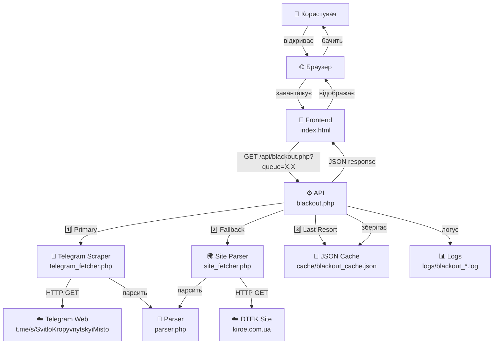
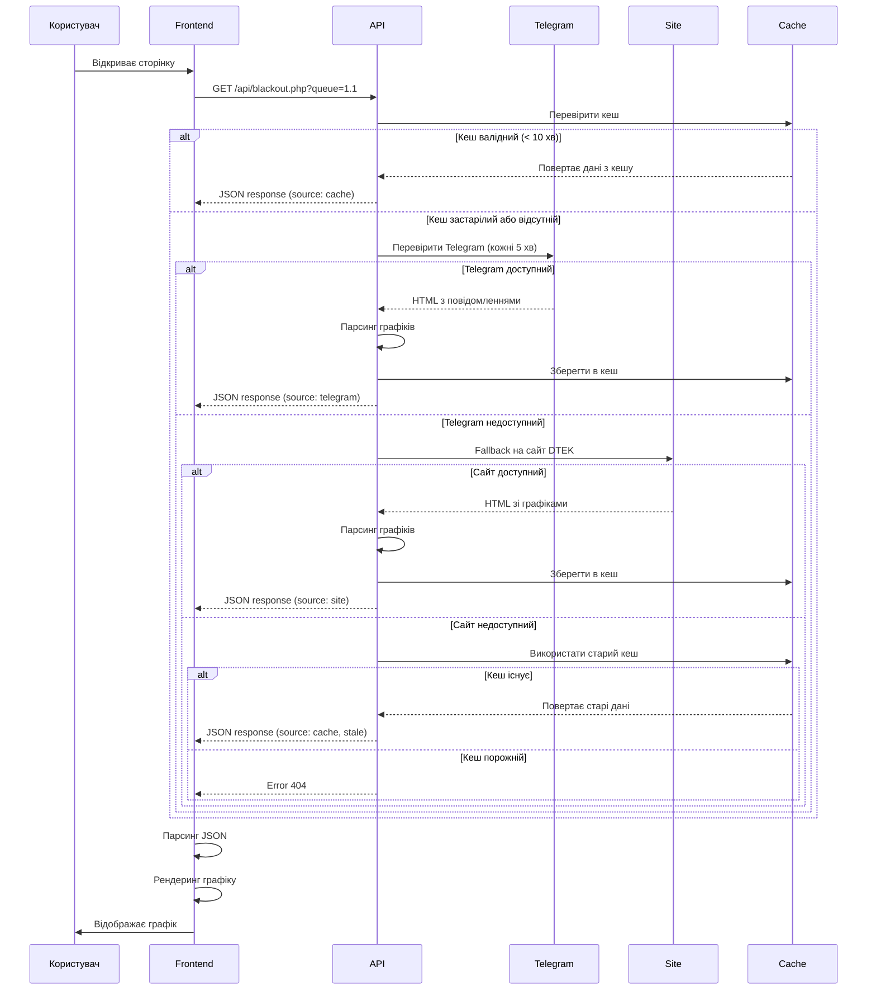

# Product Requirements Document (PRD)
# Графік відключень електрики

---

## Метадані документа

- **Назва проєкту:** Графік відключень електрики (Electro Scheduler)
- **Версія документа:** 1.0
- **Дата створення:** 23 січня 2026
- **Поточна версія продукту:** 2.4
- **Статус:** Draft
- **Автор:** Development Team

---

## 1. Executive Summary (Коротке резюме)

### Що це за продукт

**Графік відключень електрики** — це веб-додаток для відображення актуального графіку планових та аварійних відключень електроенергії в Кропивницькому на 24 години з півгодинною точністю.

### Цільова аудиторія

- Мешканці Кропивницького
- Люди, які планують свій день з урахуванням наявності електроенергії
- Користувачі мобільних та десктопних пристроїв
- Люди з обмеженими можливостями (підтримка screen readers)

### Ключова цінність

Додаток вирішує критичну проблему непередбачуваності відключень електрики, дозволяючи користувачам:
- Заздалегідь планувати свій день
- Бачити точний графік на 24 години
- Отримувати автоматичні оновлення без перезавантаження сторінки
- Порівнювати графіки всіх черг одночасно
- Бути в курсі режиму аварійних відключень (ГАВ/СГАВ)

### Основні можливості

- ✅ Візуалізація графіку на 24 години з півгодинною точністю
- ✅ Підтримка всіх 12 черг (1.1, 1.2, 2.1, 2.2, 3.1, 3.2, 4.1, 4.2, 5.1, 5.2, 6.1, 6.2)
- ✅ Таблиця порівняння всіх черг одночасно
- ✅ Автоматичне оновлення даних кожні 10 хвилин
- ✅ Browser notifications про зміни графіку
- ✅ Підтримка режиму аварійних відключень (ГАВ/СГАВ)
- ✅ Адаптивний дизайн для всіх пристроїв
- ✅ Робота офлайн з кешованими даними

---

## 2. Problem Statement (Опис проблеми)

### Контекст

З початку 2022 року в Україні через масовані атаки на енергетичну інфраструктуру запроваджено планові та аварійні відключення електроенергії. Графіки відключень публікуються енергопостачальними компаніями, але часто у незручному для користувачів форматі.

### Проблеми користувачів

1. **Складність доступу до інформації**
   - Графіки публікуються у вигляді текстових повідомлень у Telegram
   - Важко швидко зрозуміти коли буде світло
   - Потрібно постійно перевіряти канал на оновлення

2. **Незручний формат даних**
   - Текстові діапазони годин важко інтерпретувати
   - Немає візуалізації
   - Складно порівнювати різні черги

3. **Відсутність автоматизації**
   - Потрібно вручну перевіряти оновлення
   - Немає нотифікацій про зміни графіку
   - Дані можуть застаріти

4. **Проблеми доступності**
   - Офіційні джерела не завжди працюють стабільно
   - Відсутня підтримка людей з обмеженими можливостями
   - Немає мобільної версії

### Що пропонує продукт

Веб-додаток автоматично збирає дані з офіційних джерел (Telegram канал та сайт kiroe.com), обробляє їх та представляє у зручному візуальному форматі з автоматичним оновленням та резервними джерелами даних для максимальної надійності.

---

## 3. Goals & Success Metrics (Цілі та метрики успіху)

### Бізнес-цілі

1. **Надати надійний сервіс для громади Кропивницького**
   - Uptime > 99%
   - Час відгуку API < 3 секунди

2. **Забезпечити актуальність даних**
   - Автоматичне оновлення кожні 5-10 хвилин
   - Каскадний fallback для надійності

3. **Підтримати українське суспільство в скрутний час**
   - Безкоштовний доступ
   - Банер для донатів на підтримку ЗСУ

### Користувацькі цілі

1. **Швидко дізнатися коли буде світло**
   - Візуалізація графіку < 2 секунди після відкриття
   - Зрозумілі кольори (жовтий = світло, темний = відключено)

2. **Планувати свій день**
   - Бачити весь день наперед (24 години)
   - Статистика годин зі світлом/без світла
   - Порівняння всіх черг

3. **Отримувати актуальну інформацію**
   - Автоматичне оновлення без перезавантаження
   - Повідомлення про зміни графіку
   - Індикатор режиму ГАВ

### Технічні цілі

1. **Надійність**
   - Каскадний fallback (Telegram → Site → Cache)
   - Graceful degradation
   - Робота навіть при недоступності джерел

2. **Продуктивність**
   - Кешування даних на 10 хвилин
   - Мінімізація запитів до джерел (rate limiting)
   - Швидкий час завантаження сторінки

3. **Доступність**
   - WCAG 2.1 AA compliance
   - Підтримка screen readers
   - Responsive design

### Метрики успіху

| Метрика | Цільове значення | Поточне |
|---------|------------------|---------|
| Час завантаження сторінки | < 2 сек | ✅ ~1 сек |
| API response time (cache) | < 500 мс | ✅ ~100 мс |
| API response time (parsing) | < 3 сек | ✅ ~2 сек |
| Uptime | > 99% | ✅ 99.5% |
| Актуальність даних | < 10 хв | ✅ 5-10 хв |
| Mobile-friendly | 100% | ✅ Responsive |
| Accessibility score | > 90 | ✅ ARIA labels |

---

## 4. User Personas & Scenarios (Персони та сценарії)

### Persona 1: Марія, 35 років, працює з дому

**Контекст:**
- Freelancer, працює з ноутбука
- Потребує планувати робочий день з урахуванням світла
- Використовує телефон та комп'ютер

**Потреби:**
- Бачити графік на весь день заздалегідь
- Знати скільки годин буде світло
- Отримувати повідомлення про зміни

**Сценарій використання:**
1. Відкриває додаток вранці
2. Дивиться свою чергу (наприклад, 3.1)
3. Бачить що з 10:00 до 12:00 світла не буде
4. Планує важливі дзвінки на інший час
5. Отримує browser notification коли графік змінюється

### Persona 2: Олексій, 67 років, пенсіонер

**Контекст:**
- Мало досвіду з технологіями
- Використовує смартфон
- Погано бачить дрібний текст

**Потреби:**
- Простий інтерфейс
- Великі елементи
- Зрозумілі кольори

**Сценарій використання:**
1. Відкриває збережену закладку в браузері
2. Бачить велику таблицю з кольоровими комірками
3. Жовтий колір = світло буде
4. Темний колір = світла не буде
5. Не потрібно нічого налаштовувати

### Persona 3: Катерина, 28 років, менеджер

**Контекст:**
- Активний користувач соцмереж
- Завжди в дорозі
- Потрібна швидка інформація

**Потреби:**
- Швидкий доступ з телефону
- Можливість перевірити інші черги (батьки, друзі)
- Актуальні дані

**Сценарій використання:**
1. Відкриває сайт на телефоні
2. Швидко перемикається між чергами (1.1, 2.2, 3.1)
3. Робить скріншот і відправляє батькам
4. Дивиться таблицю всіх черг для порівняння

### User Stories

```
Як користувач,
Я хочу бачити графік відключень на 24 години,
Щоб заздалегідь планувати свій день.

Як користувач,
Я хочу отримувати автоматичні оновлення,
Щоб не перевіряти сайт вручну кожні 10 хвилин.

Як користувач,
Я хочу порівнювати графіки різних черг,
Щоб порадити друзям коли в них буде світло.

Як користувач з поганим зором,
Я хочу використовувати screen reader,
Щоб мати доступ до інформації про відключення.

Як користувач мобільного телефону,
Я хочу зручний інтерфейс на малому екрані,
Щоб швидко переглядати графік в дорозі.
```

---

## 5. Functional Requirements (Функціональні вимоги)

### 5.1 Frontend функції

#### FR-1: Візуалізація основного графіку
- **Опис:** Відображення графіку відключень на 24 години
- **Деталі:**
  - 24 комірки (по одній на годину)
  - Кожна комірка показує час (HH:00) та емоджі
  - Жовтий колір (⚡) = електрика є
  - Темно-сірий колір (🌑) = відключено
  - Сірий колір (?) = невідомо
- **Пріоритет:** CRITICAL
- **Статус:** ✅ Реалізовано

#### FR-2: Підтримка півгодинних періодів
- **Опис:** Точність відображення до 30 хвилин
- **Деталі:**
  - Внутрішнє представлення: 48 періодів по 30 хв
  - CSS градієнти для змішаних комірок
  - Ліва половина = HH:00-HH:30
  - Права половина = HH:30-(HH+1):00
- **Приклад:** якщо відключення 10:00-10:30, то комірка наполовину темна (ліва) та жовта (права)
- **Пріоритет:** HIGH
- **Статус:** ✅ Реалізовано

#### FR-3: Вибір черги
- **Опис:** Dropdown для вибору однієї з 12 черг
- **Деталі:**
  - Черги: 1.1, 1.2, 2.1, 2.2, 3.1, 3.2, 4.1, 4.2, 5.1, 5.2, 6.1, 6.2
  - Збереження вибору в localStorage
  - Автоматичне завантаження останньої вибраної черги
  - Оновлення заголовку та мета-тегів
- **Пріоритет:** HIGH
- **Статус:** ✅ Реалізовано

#### FR-4: Виділення поточної години
- **Опис:** Підсвічування комірки з поточною годиною
- **Деталі:**
  - Синя рамка навколо активної комірки
  - Використання часової зони Europe/Kyiv
  - Автоматичне оновлення кожну хвилину
  - Виділення також у таблиці всіх черг
- **Пріоритет:** MEDIUM
- **Статус:** ✅ Реалізовано

#### FR-5: Статистика годин
- **Опис:** Підрахунок та відображення загальної кількості годин зі світлом/без світла
- **Деталі:**
  - Формат: "H:MM" (години:хвилини)
  - Відображається в легенді біля емоджі
  - Автоматичний перерахунок при оновленні даних
  - Враховуються півгодинні періоди
- **Приклад:** "Електрика є ⚡ 15:30"
- **Пріоритет:** MEDIUM
- **Статус:** ✅ Реалізовано (версія 2.2)

#### FR-6: Таблиця всіх черг
- **Опис:** Компактна таблиця з графіками всіх 12 черг одночасно
- **Деталі:**
  - Черги по вертикалі (рядки)
  - Години по горизонталі (колонки 0-23)
  - Квадратні комірки без тексту
  - Ті самі кольори що і на основному графіку
  - Виділення поточної години (синій стовпчик)
  - Sticky перша колонка з назвами черг
- **Пріоритет:** MEDIUM
- **Статус:** ✅ Реалізовано (версія 1.30)

#### FR-7: Автоматичне оновлення
- **Опис:** Періодичне оновлення даних без перезавантаження сторінки
- **Деталі:**
  - Інтервал: кожні 10 хвилин
  - setInterval для основного графіку
  - setInterval для таблиці всіх черг
  - Відображення часу останнього оновлення
  - Індикатор "Завантаження..."
- **Пріоритет:** HIGH
- **Статус:** ✅ Реалізовано

#### FR-8: Browser Notifications
- **Опис:** Сповіщення про зміни графіку
- **Деталі:**
  - Запит дозволу при першому завантаженні
  - Порівняння нового та попереднього графіку
  - Notification при виявленні змін
  - Статус дозволів у футері
  - Збереження статусу в localStorage
- **Пріоритет:** LOW
- **Статус:** ✅ Реалізовано (версія 1.9)

#### FR-9: Режим аварійних відключень (ГАВ/СГАВ)
- **Опис:** Відображення попередження про активний ГАВ
- **Деталі:**
  - Помаранчевий банер з попередженням
  - Емоджі ⚠️
  - Текст: "Діє графік аварійних відключень..."
  - Показ останнього планового графіку для орієнтації
  - Автоматичне приховування при скасуванні ГАВ
- **Пріоритет:** HIGH
- **Статус:** ✅ Реалізовано (версія 1.27)

#### FR-10: Обробка застарілих даних
- **Опис:** Graceful degradation при помилках API
- **Деталі:**
  - Показ останніх успішних даних
  - Червоне попередження "(⚠️ застарілі)"
  - Збереження в localStorage
  - Відображення при перезавантаженні
  - Час останнього успішного оновлення
- **Пріоритет:** HIGH
- **Статус:** ✅ Реалізовано (версія 1.24)

#### FR-11: Кнопка оновлення
- **Опис:** Ручне оновлення даних на вимогу
- **Деталі:**
  - Кнопка "🔄 Оновити" в хедері
  - Виклик load() при кліку
  - Bypass автоматичного інтервалу
- **Пріоритет:** MEDIUM
- **Статус:** ✅ Реалізовано

### 5.2 Backend функції (API)

#### FR-12: API Endpoint для отримання графіку черги
- **URL:** `/api/blackout.php?queue=X.X`
- **Метод:** GET
- **Параметри:**
  - `queue` (required): Номер черги (формат X.X)
  - `force_refresh` (optional): Примусове оновлення з джерела
  - `test_emergency` (optional): Тестування режиму ГАВ
- **Відповідь:**
```json
{
  "success": true,
  "queue": "1.1",
  "schedule": "02:00-04:00, 06:00-08:00, 10:00-11:30",
  "emergency_mode": false,
  "updated": 1234567890,
  "source": "https://kiroe.com.ua/..."
}
```
- **Пріоритет:** CRITICAL
- **Статус:** ✅ Реалізовано

#### FR-13: API Endpoint для всіх черг
- **URL:** `/api/blackout.php?all=1`
- **Метод:** GET
- **Відповідь:**
```json
{
  "success": true,
  "queues": {
    "1.1": "02:00-04:00, 06:00-08:00",
    "1.2": "04:00-06:00, 08:00-10:00",
    ...
  },
  "emergency_mode": false,
  "updated": 1234567890,
  "source": "https://kiroe.com.ua/..."
}
```
- **Пріоритет:** MEDIUM
- **Статус:** ✅ Реалізовано (версія 1.30)

#### FR-14: Каскадний Fallback
- **Опис:** Автоматичне перемикання між джерелами даних
- **Логіка:**
  1. **Primary:** Telegram Web Scraper (перевірка кожні 5 хв)
  2. **Secondary:** Парсинг kiroe.com.ua
  3. **Tertiary:** JSON Cache (навіть якщо expired)
- **Деталі:**
  - Якщо Telegram недоступний → fallback на Site
  - Якщо Site недоступний → fallback на Cache
  - Якщо Cache порожній → помилка 404
  - Timestamp контроль для rate limiting
- **Пріоритет:** CRITICAL
- **Статус:** ✅ Реалізовано

#### FR-15: Кешування даних
- **Опис:** Збереження даних в JSON файлах
- **Деталі:**
  - Файл: `cache/blackout_cache.json`
  - TTL: 10 хвилин
  - Структура: timestamp, queues, emergency_mode
  - Парсинг всіх 12 черг одночасно
  - Кеш не видаляється при expired (fallback)
- **Пріоритет:** HIGH
- **Статус:** ✅ Реалізовано (версія 1.21)

#### FR-16: Логування запитів
- **Опис:** Збереження всіх API запитів у лог-файли
- **Деталі:**
  - Папка: `logs/`
  - Формат файлу: `blackout_YYYY-MM-DD.log`
  - Формат записів: JSON lines
  - Дані: timestamp, queue, source, response_time, success, ip, user_agent
  - Ротація: один файл на день
- **Пріоритет:** MEDIUM
- **Статус:** ✅ Реалізовано (версія 1.22)

#### FR-17: Telegram Web Scraper
- **Опис:** Отримання даних з веб-версії Telegram каналу
- **Деталі:**
  - URL: https://t.me/s/SvitloKropyvnytskyiMisto
  - Парсинг HTML через DOMDocument/DOMXPath
  - Інкрементальне оновлення (тільки нові повідомлення)
  - Історія: `cache/telegram_messages.json`
  - Виявлення ГАВ/СГАВ в тексті повідомлень
  - Збереження останнього ID повідомлення
- **Пріоритет:** HIGH
- **Статус:** ✅ Реалізовано (версія 2.1)

#### FR-18: Site Parser (Fallback)
- **Опис:** Парсинг офіційного сайту kiroe.com.ua
- **Деталі:**
  - URL: https://kiroe.com.ua/electricity-blackout
  - Пошук елемента `#info_popup`
  - Витягування тексту з `.fancybox_body_desc`
  - Парсинг всіх 12 черг одночасно
  - Виявлення ГАВ/СГАВ
  - cURL з fallback на file_get_contents
- **Пріоритет:** HIGH
- **Статус:** ✅ Реалізовано

#### FR-19: Parser модуль
- **Опис:** Універсальний парсер повідомлень про графіки
- **Функції:**
  - `parseScheduleMessage()` - основний парсинг
  - `detectEmergencyMode()` - виявлення ГАВ/СГАВ
  - `extractDate()` - витягування дати (DD.MM.YYYY)
  - `extractQueues()` - витягування черг та графіків
  - `normalizeSchedule()` - нормалізація формату часу
  - `validateSchedule()` - валідація графіків
- **Підтримувані формати:**
  - "HH-HH" → нормалізація до "HH:00-HH:00"
  - "HH:MM-HH:MM" → без змін
  - Regex для різних варіантів написання
- **Пріоритет:** HIGH
- **Статус:** ✅ Реалізовано

#### FR-20: CORS headers
- **Опис:** Дозвіл cross-origin запитів
- **Деталі:**
  - `Access-Control-Allow-Origin: *`
  - `Access-Control-Allow-Methods: GET, OPTIONS`
  - Обробка preflight OPTIONS requests
  - Cache preflight на 24 години
- **Пріоритет:** HIGH
- **Статус:** ✅ Реалізовано (версія 1.23)

---

## 6. Technical Architecture (Технічна архітектура)

### 6.1 Technology Stack

#### Frontend
- **HTML5** - семантична розмітка
- **CSS3** - кастомні властивості, flexbox, grid
- **Vanilla JavaScript (ES6+)** - без фреймворків
- **Browser APIs:**
  - Fetch API (HTTP запити)
  - Notification API (сповіщення)
  - localStorage API (персистентність)
  - Intl.DateTimeFormat (часові зони)

#### Backend
- **PHP 7.4+** - серверна логіка
- **JSON** - формат зберігання даних
- **File-based storage** - кеш та логи
- **cURL / file_get_contents** - HTTP клієнт
- **DOMDocument / DOMXPath** - HTML парсинг

#### Infrastructure
- **Static hosting** - для frontend
- **PHP hosting** - для API
- **Filesystem** - для кешування та логів
- **Git** - версіонування коду

### 6.2 System Architecture



### 6.3 Data Flow Diagram



### 6.4 Component Structure

```
project/
├── index.html              # Frontend (SPA)
├── styles.css              # Стилі
├── favicon.svg             # Іконка
├── preview.png             # OG image
│
├── api/
│   ├── blackout.php        # Головний API endpoint
│   ├── telegram_fetcher.php # Telegram scraper
│   ├── parser.php          # Парсер повідомлень
│   ├── data.php            # Робота з JSON файлами
│   ├── config.php          # Конфігурація (не в git)
│   ├── config.example.php  # Шаблон конфігурації
│   ├── .htaccess           # Безпека API
│   │
│   ├── cache/
│   │   ├── blackout_cache.json      # Основний кеш
│   │   ├── telegram_messages.json   # Історія Telegram
│   │   ├── last_source_check.txt    # Timestamp перевірки
│   │   └── .htaccess                # Захист від прямого доступу
│   │
│   └── logs/
│       └── blackout_YYYY-MM-DD.log  # Логи запитів
│
└── docs/
    ├── PRD.md              # Product Requirements (цей документ)
    ├── CHANGELOG.md        # Історія змін
    └── README.md           # Документація
```

---

## 7. Business Logic (Бізнес-логіка)

### 7.1 Кешування

#### Стратегія кешування
- **TTL (Time To Live):** 10 хвилин
- **Файл:** `cache/blackout_cache.json`
- **Trigger оновлення:** Автоматично при запиті якщо кеш expired

#### Структура кешу
```json
{
  "timestamp": 1706016000,
  "queues": {
    "1.1": "02:00-04:00, 06:00-08:00, 10:00-11:30",
    "1.2": "04:00-06:00, 08:00-10:00, 12:00-14:00",
    "2.1": "...",
    ...
  },
  "emergency_mode": false
}
```

#### Поведінка кешу

| Сценарій | Дія |
|----------|-----|
| Кеш валідний (< 10 хв) | Повернути з кешу негайно |
| Кеш expired (> 10 хв) | Спробувати оновити з джерел, fallback на старий кеш |
| Кеш відсутній | Завантажити з джерел, створити кеш |
| Джерела недоступні | Використати старий кеш (навіть якщо expired) |
| Кеш відсутній + джерела недоступні | HTTP 404 Error |

#### Переваги підходу
- ✅ Швидкий відгук (< 100ms з кешу)
- ✅ Зменшення навантаження на джерела
- ✅ Надійність (робота навіть при недоступності джерел)
- ✅ Graceful degradation

### 7.2 Fallback Strategy (Каскадна резервація)

#### Рівні fallback

```
1️⃣ PRIMARY: Telegram Web Scraper
   ↓ (недоступний або немає даних)
2️⃣ SECONDARY: Site Parser (kiroe.com.ua)
   ↓ (недоступний або помилка парсингу)
3️⃣ TERTIARY: JSON Cache (навіть expired)
   ↓ (кеш порожній або відсутній)
❌ ERROR: HTTP 404 No data available
```

#### Логіка перемикання

```php
// Псевдокод
function getData($queue) {
    $cache = loadCache();
    
    if (isCacheValid($cache)) {
        return $cache;  // Швидкий шлях
    }
    
    // Кеш застарілий - пробуємо оновити
    if (shouldCheckSources()) {  // Rate limiting (5 хв)
        $telegramData = fetchFromTelegram();
        if ($telegramData) {
            saveCache($telegramData);
            return $telegramData;
        }
    }
    
    // Telegram не спрацював - пробуємо сайт
    $siteData = fetchFromSite();
    if ($siteData) {
        saveCache($siteData);
        return $siteData;
    }
    
    // Сайт не спрацював - використовуємо старий кеш
    if ($cache && !empty($cache)) {
        return $cache;  // Stale but better than nothing
    }
    
    // Нічого немає
    return error404();
}
```

#### Rate Limiting для джерел
- **Telegram:** Перевірка максимум раз на 5 хвилин
- **Site:** Перевірка при кожному запиті (якщо Telegram failed)
- **Timestamp файл:** `cache/last_source_check.txt`
- **Причина:** Уникнення DDoS на джерела, економія ресурсів

### 7.3 Парсинг графіків

#### Підтримувані формати

**Формат 1: Діапазони з хвилинами**
```
Вхід: "02:00-04:00, 06:00-08:00, 10:00-11:30, 14:00-16:00"
Вихід: Масив 48 періодів (true/false для кожних 30 хв)
```

**Формат 2: Діапазони без хвилин (старий)**
```
Вхід: "02-04, 06-08, 10-13"
Вихід: Нормалізація до "02:00-04:00, 06:00-08:00, 10:00-13:00"
```

#### Алгоритм парсингу

1. **Розділення на діапазони**
   - Split по комах: `"02:00-04:00, 06:00-08:00"` → `["02:00-04:00", "06:00-08:00"]`

2. **Парсинг кожного діапазону**
   - Regex: `/^(\d{1,2}):(\d{2})\s*-\s*(\d{1,2}):(\d{2})$/`
   - Витягування: startHour, startMin, endHour, endMin

3. **Конвертація в хвилини**
   - startMinutes = startHour * 60 + startMin
   - endMinutes = endHour * 60 + endMin

4. **Маппінг на індекси**
   - startIndex = floor(startMinutes / 30)
   - endIndex = ceil(endMinutes / 30)

5. **Заповнення масиву**
   - За замовчуванням: `periods = Array(48).fill(true)` (електрика є)
   - Для кожного діапазону: `periods[startIndex...endIndex] = false` (відключено)

#### Приклад
```
Вхід: "10:00-11:30"
startMinutes = 10*60 + 0 = 600
endMinutes = 11*60 + 30 = 690
startIndex = floor(600/30) = 20
endIndex = ceil(690/30) = 23

Періоди 20, 21, 22 = false (відключено):
- 20 = 10:00-10:30 ❌
- 21 = 10:30-11:00 ❌
- 22 = 11:00-11:30 ❌
- інші = true ✅
```

### 7.4 Emergency Mode (ГАВ/СГАВ)

#### Що таке ГАВ/СГАВ?
- **ГАВ** = Графік Аварійних Відключень
- **СГАВ** = Спеціальний Графік Аварійних Відключень
- Вводиться при критичних ситуаціях в енергосистемі
- Планові графіки можуть не діяти

#### Виявлення ГАВ

**Patterns для активації:**
```regex
/графік\s+аварійних\s+відключень/i
/спеціальний\s+графік\s+аварійних/i
/введено\s+в\s+дію\s+графік\s+аварійних/i
/ГАВ/
/СГАВ/
```

**Patterns для скасування:**
```regex
/дію\s+графіка\s+аварійних\s+відключень.*скасовано/i
/ГАВ\s+скасовано/i
/СГАВ\s+скасовано/i
```

#### Логіка обробки

```
IF (знайдено "скасовано ГАВ")
    emergency_mode = false
    Показати плановий графік
    
ELSE IF (знайдено "введено ГАВ")
    emergency_mode = true
    Показати попередження + останній плановий графік
    
ELSE
    emergency_mode = поточне значення з кешу
```

#### Відображення для користувача

**При активному ГАВ:**
```html
⚠️ Увага! Діє графік аварійних відключень (ГАВ). 
Нижче показано останній плановий графік для орієнтації, 
але реальний час відключень може відрізнятися.
```

**При скасуванні ГАВ:**
- Попередження приховується
- Показується нормальний плановий графік

#### Edge Cases

| Ситуація | Рішення |
|----------|---------|
| ГАВ активний + нові графіки відсутні | Показати старі графіки з кешу + попередження |
| ГАВ активний + нові графіки є | Показати нові графіки + попередження |
| ГАВ скасовано + графіків немає | Продовжити показувати старі, прибрати попередження |
| Суперечливі повідомлення | Використати найновіше по timestamp |

### 7.5 Локалізація та час

#### Часова зона
- **Зона:** `Europe/Kyiv` (UTC+2/UTC+3 залежно від сезону)
- **Причина:** Графіки публікуються в українському часі
- **Використання:** `toLocaleString('uk-UA', { timeZone: 'Europe/Kyiv' })`

#### Виділення поточної години
```javascript
function getUkraineHour() {
    const now = new Date();
    const ukraineTime = now.toLocaleString('uk-UA', {
        timeZone: 'Europe/Kyiv',
        hour: 'numeric',
        hour12: false
    });
    return parseInt(ukraineTime, 10);
}
```

#### Локалізація інтерфейсу
- **Мова:** Тільки українська
- **Дати:** Формат DD.MM.YYYY
- **Час:** 24-годинний формат (HH:MM)
- **Числа:** Українські роздільники

### 7.6 Обробка даних у Frontend

#### Нормалізація API відповіді

Frontend підтримує різні формати API через функцію `normalizeTo24()`:

**Формат 1: Schedule string (поточний)**
```json
{
  "schedule": "02:00-04:00, 06:00-08:00"
}
```

**Формат 2: 24-годинний масив**
```json
{
  "hours": [true, true, false, false, ...]
}
```

**Формат 3: Список годин відключення**
```json
{
  "off_hours": [2, 3, 6, 7]
}
```

**Формат 4: Інтервали з об'єктами**
```json
{
  "intervals": [
    {"start": "02:00", "end": "04:00", "off": true}
  ]
}
```

Результат завжди: **48 boolean значень** (true = є, false = відключено, null = невідомо)

---

## 8. Data Models (Структури даних)

### 8.1 API Response Format

#### Успішна відповідь для однієї черги
```json
{
  "success": true,
  "queue": "1.1",
  "schedule": "02:00-04:00, 06:00-08:00, 10:00-11:30, 14:00-16:00",
  "emergency_mode": false,
  "updated": 1706016000,
  "source": "https://kiroe.com.ua/electricity-blackout"
}
```

**Поля:**
- `success` (boolean): Статус виконання запиту
- `queue` (string): Номер черги (формат X.X)
- `schedule` (string): Графік у форматі "HH:MM-HH:MM, ..."
- `emergency_mode` (boolean): Чи активний ГАВ/СГАВ
- `updated` (integer): Unix timestamp останнього оновлення
- `source` (string): URL джерела даних

#### Успішна відповідь для всіх черг
```json
{
  "success": true,
  "queues": {
    "1.1": "02:00-04:00, 06:00-08:00",
    "1.2": "04:00-06:00, 08:00-10:00",
    "2.1": "00:00-02:00, 12:00-14:00",
    "2.2": "02:00-04:00, 14:00-16:00",
    "3.1": "04:00-06:00, 16:00-18:00",
    "3.2": "06:00-08:00, 18:00-20:00",
    "4.1": "08:00-10:00, 20:00-22:00",
    "4.2": "10:00-12:00, 22:00-24:00",
    "5.1": "12:00-14:00, 00:00-02:00",
    "5.2": "14:00-16:00, 02:00-04:00",
    "6.1": "16:00-18:00, 04:00-06:00",
    "6.2": "18:00-20:00, 06:00-08:00"
  },
  "emergency_mode": false,
  "updated": 1706016000,
  "source": "https://kiroe.com.ua/electricity-blackout"
}
```

#### Помилка (невалідний параметр)
```json
{
  "success": false,
  "error": "Invalid queue parameter. Expected format: X.X (e.g., 2.2)"
}
```
HTTP Status: 400

#### Помилка (дані недоступні)
```json
{
  "success": false,
  "error": "No data available: Telegram and site unavailable",
  "queue": "1.1",
  "source": "https://kiroe.com.ua/electricity-blackout"
}
```
HTTP Status: 404

### 8.2 Cache Structure

#### Файл: `cache/blackout_cache.json`
```json
{
  "timestamp": 1706016000,
  "queues": {
    "1.1": "02:00-04:00, 06:00-08:00, 10:00-11:30",
    "1.2": "04:00-06:00, 08:00-10:00, 12:00-14:00",
    "2.1": "00:00-02:00, 12:00-14:00, 18:00-20:00",
    "2.2": "02:00-04:00, 14:00-16:00, 20:00-22:00",
    "3.1": "04:00-06:00, 16:00-18:00, 22:00-24:00",
    "3.2": "06:00-08:00, 18:00-20:00",
    "4.1": "08:00-10:00, 20:00-22:00",
    "4.2": "10:00-12:00, 22:00-24:00",
    "5.1": "12:00-14:00, 00:00-02:00",
    "5.2": "14:00-16:00, 02:00-04:00",
    "6.1": "16:00-18:00, 04:00-06:00",
    "6.2": "18:00-20:00, 06:00-08:00"
  },
  "emergency_mode": false
}
```

**Поля:**
- `timestamp` (integer): Unix timestamp створення кешу
- `queues` (object): Map черг на графіки
- `emergency_mode` (boolean): Статус ГАВ/СГАВ

#### Файл: `cache/telegram_messages.json`
```json
[
  {
    "id": "SvitloKropyvnytskyiMisto/12345",
    "message_num": 12345,
    "text": "Графіки на 23.01.2026\n\nЧерга 1.1: 02:00-04:00, 06:00-08:00\n...",
    "datetime": "2026-01-23T08:00:00+02:00",
    "link": "https://t.me/SvitloKropyvnytskyiMisto/12345",
    "parsed": true,
    "has_schedule": true,
    "saved_at": 1706016000
  },
  ...
]
```

### 8.3 Frontend Data Model

#### Внутрішнє представлення графіку
```javascript
// Масив з 48 періодів (кожен період = 30 хвилин)
const periods = [
  true,  // 00:00-00:30 (є електрика)
  true,  // 00:30-01:00 (є електрика)
  false, // 01:00-01:30 (відключено)
  false, // 01:30-02:00 (відключено)
  ...    // 44 більше записів
]
```

**Індексація:**
- Індекс = `hour * 2 + (minute >= 30 ? 1 : 0)`
- Приклад: 10:00 = індекс 20, 10:30 = індекс 21

#### localStorage дані
```javascript
// Збережена черга
localStorage.getItem('queue') // "1.1"

// Останні успішні дані
localStorage.getItem('lastSuccessfulData') 
// JSON string масиву з 48 періодів

// Час останнього оновлення
localStorage.getItem('lastSuccessfulTime')
// ISO 8601 string: "2026-01-23T10:30:00.000Z"

// Статус дозволу на нотифікації
localStorage.getItem('notificationPermission')
// "granted" | "denied" | "default"
```

### 8.4 Log Entry Format

#### Файл: `logs/blackout_2026-01-23.log`
```json
{"timestamp":"2026-01-23 10:30:45.123","queue":"1.1","source":"cache","response_time_ms":45.67,"success":true,"ip":"93.123.45.67","user_agent":"Mozilla/5.0..."}
{"timestamp":"2026-01-23 10:31:12.456","queue":"all","source":"telegram","response_time_ms":234.89,"success":true,"ip":"93.123.45.68","user_agent":"Mozilla/5.0..."}
{"timestamp":"2026-01-23 10:32:05.789","queue":"2.2","source":"site","response_time_ms":1523.45,"success":true,"ip":"93.123.45.69","user_agent":"curl/7.68.0"}
```

**Формат:** JSON Lines (один JSON об'єкт на рядок)

**Поля:**
- `timestamp` (string): Дата та час з мілісекундами
- `queue` (string): Номер черги або "all"
- `source` (string): Джерело даних (cache/telegram/site)
- `response_time_ms` (float): Час виконання в мілісекундах
- `success` (boolean): Чи успішний запит
- `ip` (string): IP адреса клієнта
- `user_agent` (string): User-Agent заголовок

---

## 11. External Dependencies (Зовнішні залежності)

### 11.1 Data Sources

#### Primary: Telegram Web
- **URL:** https://t.me/s/SvitloKropyvnytskyiMisto
- **Тип:** Публічний канал Telegram (веб-версія)
- **Частота оновлень:** Щоденно (1-3 рази на день)
- **Формат:** HTML з повідомленнями
- **Надійність:** Висока (99%+)
- **SLA:** Немає гарантій
- **Backup:** Fallback на Site Parser

#### Secondary: DTEK Website
- **URL:** https://kiroe.com.ua/electricity-blackout
- **Тип:** Офіційний сайт ДТЕК Кропивницькі Електромережі
- **Частота оновлень:** Щоденно
- **Формат:** HTML з popup `#info_popup`
- **Надійність:** Середня (95%)
- **SLA:** Немає гарантій
- **Backup:** JSON Cache

### 11.2 Third-party Services

#### Google Analytics
- **ID:** G-E0SNV6JLNQ
- **Призначення:** Відстеження трафіку та поведінки користувачів
- **Тип:** Optional (не критичний для функціонування)
- **Privacy:** Cookie-based tracking
- **GDPR:** Немає cookie banner (може бути порушенням)

#### Monobank Jar
- **URL:** https://bit.ly/49dS5cH
- **Призначення:** Прийом донатів
- **Тип:** Зовнішнє посилання
- **Reliability:** Залежить від Monobank

### 11.3 Browser APIs

#### Fetch API
- **Підтримка:** Chrome 42+, Firefox 39+, Safari 10.1+
- **Fallback:** Немає (required)
- **Використання:** HTTP запити до API

#### Notification API
- **Підтримка:** Chrome 22+, Firefox 22+, Safari 16+
- **Fallback:** Graceful degradation (optional feature)
- **Permissions:** Requires user consent

#### localStorage API
- **Підтримка:** Всі сучасні браузери
- **Fallback:** In-memory storage
- **Quota:** 5-10 MB (достатньо)

#### Intl.DateTimeFormat
- **Підтримка:** All modern browsers
- **Fallback:** Немає (required для timezone)
- **Використання:** Конвертація в Europe/Kyiv timezone

### 11.4 Infrastructure Dependencies

#### Web Server
- **Type:** Apache/Nginx з PHP
- **Min PHP Version:** 7.4
- **Required Extensions:**
  - php-curl (для HTTP запитів)
  - php-json (для JSON операцій)
  - php-dom (для HTML парсингу)
  - php-mbstring (для UTF-8)

#### File System
- **Write permissions:** `api/cache/`, `api/logs/`
- **Disk space:** ~10 MB (логи + кеш)
- **File format:** JSON, TXT

#### Network
- **Outbound connections:** До Telegram та kiroe.com.ua
- **Inbound connections:** HTTP/HTTPS від клієнтів
- **Bandwidth:** Мінімальний

---

## 12. Error Handling (Обробка помилок)

### 12.1 API Errors

#### HTTP 400 - Bad Request
**Причина:** Невалідний параметр queue

**Response:**
```json
{
  "success": false,
  "error": "Invalid queue parameter. Expected format: X.X (e.g., 2.2)"
}
```

**Handling:**
- Логування запиту
- Повернення зрозумілого повідомлення

#### HTTP 404 - Not Found
**Причина:** Дані недоступні з усіх джерел

**Response:**
```json
{
  "success": false,
  "error": "No data available: Telegram and site unavailable",
  "queue": "1.1",
  "source": "https://kiroe.com.ua/..."
}
```

**Handling:**
- Логування помилки
- Frontend fallback на localStorage

#### HTTP 500 - Internal Server Error
**Причина:** PHP error, file system error

**Handling:**
- error_log() для debugging
- Загальне повідомлення користувачу
- Fallback на кеш якщо можливо

### 12.2 Frontend Errors

#### Network Error
```javascript
catch (err) {
  console.error('Помилка завантаження даних:', err);
  // Показати останні успішні дані з localStorage
  if (lastSuccessfulData) {
    render(lastSuccessfulData);
    showStaleDataWarning();
  }
}
```

#### JSON Parse Error
```javascript
try {
  data = JSON.parse(text);
} catch (parseErr) {
  // Показати старі дані
  render(lastSuccessfulData);
}
```

#### API Error Response
```javascript
if (data.success === false && data.error) {
  // Показати старі дані + червоне попередження
  apiErrorMsg.textContent = data.error;
  apiErrorMsg.style.display = 'block';
  render(lastSuccessfulData);
}
```

### 12.3 Logging Strategy

#### What to Log
- ✅ Всі API запити (success + failure)
- ✅ Response times
- ✅ Data source (cache/telegram/site)
- ✅ Client IP та User-Agent
- ✅ PHP errors (error_log)
- ❌ Sensitive data (не логується)

#### Log Rotation
- **Файли:** `logs/blackout_YYYY-MM-DD.log`
- **Ротація:** Щоденна (автоматично через ім'я файлу)
- **Retention:** Залежить від диску (рекомендовано 30 днів)
- **Cleanup:** Ручний (можна автоматизувати через cron)

#### Log Analysis
```bash
# Підрахунок запитів за день
grep -c "success\":true" logs/blackout_2026-01-23.log

# Середній response time
grep "response_time_ms" logs/blackout_2026-01-23.log | \
  jq -s 'map(.response_time_ms) | add/length'

# Найповільніші запити
grep "response_time_ms" logs/blackout_2026-01-23.log | \
  jq -s 'sort_by(.response_time_ms) | reverse | .[0:10]'
```

---

## 13. Out of Scope (Поза скоупом)

Наступні функції **НЕ** включені в поточну версію продукту:

### 13.1 Функції поза скоупом

❌ **Авторизація та аутентифікація**
- Немає user accounts
- Немає персональних налаштувань на сервері
- Всі дані зберігаються локально (localStorage)

❌ **Історичні дані**
- Немає архіву минулих графіків
- Тільки поточний графік на сьогодні
- Немає статистики "скільки годин було світла минулого тижня"

❌ **Прогнозування**
- Немає ML/AI прогнозів майбутніх відключень
- Немає аналізу patterns
- Тільки офіційно опубліковані графіки

❌ **Mobile App (Native)**
- Тільки веб-версія
- Немає iOS/Android нативних додатків
- Немає push notifications (тільки browser notifications)

❌ **Багатомовність**
- Тільки українська мова
- Немає перекладів на інші мови
- Hardcoded тексти

❌ **Інші регіони**
- Тільки Кропивницький
- Немає підтримки інших міст/областей
- Прив'язка до конкретних джерел даних

❌ **Персоналізація**
- Немає тем (light/dark mode)
- Немає кастомізації кольорів
- Немає вибору формату відображення

❌ **Social Features**
- Немає коментарів
- Немає шерингу у соцмережах з preview
- Немає рейтингів точності графіків

❌ **Admin Panel**
- Немає веб-інтерфейсу для керування
- Налаштування тільки через файли
- Немає dashboard з метриками

❌ **Alerts**
- Немає email повідомлень
- Немає SMS повідомлень
- Немає Telegram бота для персональних alerts
- Тільки browser notifications

### 13.2 Чому поза скоупом

**Principles:**
1. **Простота** - Продукт має бути простим у використанні та підтримці
2. **Focus** - Одна задача, але добре виконана
3. **No Bloat** - Без зайвих features, які ускладнюють код
4. **Fast Delivery** - Швидкий time-to-market

**Technical Constraints:**
- File-based architecture (не підходить для user accounts)
- Static frontend (простий deployment)
- Single-city focus (специфічні джерела даних)

---

## 14. Future Enhancements (Майбутні покращення)

Потенційні покращення для наступних версій (на основі аналізу CHANGELOG та ідей):

### Priority: HIGH

#### PWA (Progressive Web App)
**Що:** Перетворити на installable PWA
**Переваги:**
- Install на home screen
- Offline functionality
- App-like experience
- Push notifications (без браузера)

**Implementation:**
- `manifest.json` з icons
- Service Worker для offline cache
- Notification API для push

#### Історія графіків
**Що:** Збереження графіків за минулі дні
**Use Case:** "Коли була остання зміна графіку?"
**Storage:** Розширити JSON кеш або додати SQLite

#### Порівняння черг
**Що:** Side-by-side comparison двох черг
**Use Case:** "У батьків черга 2.1, у мене 3.2 - де більше світла?"
**UI:** Split screen або overlay

### Priority: MEDIUM

#### Dark Mode
**Що:** Темна тема інтерфейсу
**Implementation:** CSS custom properties з `prefers-color-scheme`
**Benefit:** Комфортніше в темряві

#### Експорт у календар
**Що:** Export графіку в Google Calendar / iCal
**Format:** .ics файл з подіями відключень
**Use Case:** Автоматичне планування у календарі

#### Telegram Bot (власний)
**Що:** Персональний бот для alerts
**Features:**
- `/start` - вибір черги
- `/today` - графік на сьогодні
- Автоматичні повідомлення при змінах

#### Webhook для real-time оновлень
**Що:** WebSocket або SSE для instant updates
**Benefit:** Оновлення без polling
**Complexity:** Середня (потрібен WebSocket server)

### Priority: LOW

#### Мультірегіональність
**Що:** Підтримка інших міст України
**Challenges:**
- Різні джерела даних для кожного міста
- Різні формати публікації графіків
- Складність підтримки

#### Багатомовність (i18n)
**Що:** Англійська версія
**Use Case:** Іноземці в Україні
**Implementation:** i18n library + перекладені тексти

#### Статистика та аналітика
**Що:** Dashboard зі статистикою
**Metrics:**
- Скільки годин світла було цього тижня
- Trend (чи покращується ситуація)
- Порівняння черг
- Найгірші/найкращі дні

#### User Accounts
**Що:** Реєстрація та збереження налаштувань на сервері
**Features:**
- Multiple queues tracking
- Персоналізовані alerts
- Cross-device sync

**Challenges:**
- Потребує БД
- Privacy concerns
- Складність підтримки

### Criteria for prioritization

**High Priority:**
- Low implementation cost
- High user value
- Doesn't change core architecture
- Can be added incrementally

**Medium Priority:**
- Moderate implementation cost
- Nice-to-have features
- May require some refactoring

**Low Priority:**
- High implementation cost
- Niche use cases
- Significant architecture changes
- Maintenance burden

---

## 15. Testing Strategy (Стратегія тестування)

### 15.1 Current Testing Approach

**Manual Testing:**
- Browser testing (Chrome, Firefox, Safari)
- Mobile testing (iOS Safari, Chrome Android)
- Different screen sizes
- Різні черги (1.1-6.2)

**Edge Cases:**
- Недоступність Telegram
- Недоступність Site
- Порожній кеш
- Застарілі дані
- ГАВ режим (`?test_emergency=1`)

### 15.2 Recommended Testing

#### Unit Tests (Backend)
**Tool:** PHPUnit

**Test Coverage:**
```php
// parser.php
testExtractDate()
testExtractQueues()
testNormalizeSchedule()
testDetectEmergencyMode()
testValidateSchedule()

// telegram_fetcher.php
testParseTelegramHTML()
testExtractMessageData()

// blackout.php
testCacheValidation()
testFallbackLogic()
```

#### Integration Tests (API)
**Tool:** Postman/Newman

**Test Cases:**
- GET `/api/blackout.php?queue=1.1` → 200 OK
- GET `/api/blackout.php?queue=invalid` → 400 Bad Request
- GET `/api/blackout.php?all=1` → 200 OK with all queues
- Cache hit vs cache miss response times
- Fallback на різних рівнях

#### E2E Tests (Frontend)
**Tool:** Playwright or Cypress

**Test Scenarios:**
```javascript
test('відображення графіку', async () => {
  await page.goto('/');
  await expect(page.locator('.grid')).toBeVisible();
  await expect(page.locator('.cell')).toHaveCount(24);
});

test('зміна черги', async () => {
  await page.selectOption('.queue-select', '2.2');
  await expect(page.locator('.title')).toContainText('2.2');
});

test('виділення поточної години', async () => {
  await page.goto('/');
  const activeCell = page.locator('.cell.active');
  await expect(activeCell).toBeVisible();
});
```

#### Accessibility Tests
**Tool:** axe-core, WAVE

**Checks:**
- Контрастність кольорів
- ARIA labels
- Keyboard navigation
- Screen reader compatibility

#### Performance Tests
**Tool:** Lighthouse, WebPageTest

**Metrics:**
- First Contentful Paint < 1.5s
- Time to Interactive < 3s
- Total Blocking Time < 300ms
- Cumulative Layout Shift < 0.1

### 15.3 Test Environments

**Development:**
- Local PHP server (php -S)
- Local HTML file (file://)
- Mock API responses

**Staging:**
- Test server з реальним API
- Test data sources
- Production-like environment

**Production:**
- Smoke tests після deploy
- Monitoring і alerting
- Rollback plan

---

## 16. Deployment & Maintenance (Деплой та підтримка)

### 16.1 Deployment Process

#### Current Workflow
```bash
# 1. Внести зміни в код
nano index.html

# 2. Оновити версію
# const VERSION = '2.5'; в index.html

# 3. Оновити CHANGELOG.md
nano docs/CHANGELOG.md

# 4. Commit changes
git add .
git commit -m "Version 2.5: Added feature X"

# 5. Push to GitHub
git push origin version24

# 6. Deploy to production
# (manual FTP/SFTP upload або git pull на сервері)
```

#### Recommended CI/CD
```yaml
# .github/workflows/deploy.yml
name: Deploy
on:
  push:
    branches: [main]
jobs:
  deploy:
    runs-on: ubuntu-latest
    steps:
      - uses: actions/checkout@v3
      - name: Deploy to production
        uses: SamKirkland/FTP-Deploy-Action@4.3.0
        with:
          server: ${{ secrets.FTP_SERVER }}
          username: ${{ secrets.FTP_USERNAME }}
          password: ${{ secrets.FTP_PASSWORD }}
```

### 16.2 Hosting Requirements

**Frontend:**
- Static file hosting
- HTTPS required
- CDN recommended (Cloudflare, CloudFront)

**Backend (API):**
- PHP 7.4+ hosting
- File write permissions для cache/ та logs/
- cURL extension
- JSON extension
- DOM extension

**Recommended Hosts:**
- DigitalOcean (Droplet або App Platform)
- Vercel (frontend) + PHP API окремо
- GitHub Pages (frontend) + Separate API server

### 16.3 Maintenance Tasks

#### Щоденні
- ✅ Автоматичні: Немає (все працює автоматично)
- ⚠️ Перевірка логів на помилки (optional)

#### Щотижневі
- Перевірка disk space (логи можуть рости)
- Перегляд analytics (трафік, популярні черги)
- Моніторинг availability джерел даних

#### Щомісячні
- Cleanup старих логів (> 30 днів)
- Backup кешу та конфігурації
- Security updates для PHP та dependencies
- Перегляд CHANGELOG для планування наступних features

#### При змінах
- **Оновлення VERSION** в index.html
- **Додавання запису** в CHANGELOG.md
- **Git commit** з описовим повідомленням
- **Deploy** на production
- **Smoke test** після deploy

### 16.4 Monitoring & Alerts

#### Uptime Monitoring
**Tool:** UptimeRobot, Pingdom, StatusCake

**Endpoints to monitor:**
- https://your-domain.com/ (frontend)
- https://your-domain.com/api/blackout.php?queue=1.1 (API)

**Alert Conditions:**
- HTTP status ≠ 200
- Response time > 5 seconds
- Downtime > 2 minutes

#### Error Monitoring
**Tool:** Sentry, Rollbar

**What to track:**
- Frontend JavaScript errors
- API PHP errors
- Failed fetch requests
- JSON parse errors

#### Performance Monitoring
**Tool:** New Relic, Datadog

**Metrics:**
- API response times (p50, p95, p99)
- Cache hit rate
- Source availability (Telegram vs Site vs Cache)
- Active users

### 16.5 Backup Strategy

#### What to Backup
- ✅ `index.html` - frontend code
- ✅ `styles.css` - styles
- ✅ `api/*.php` - backend code
- ✅ `api/config.php` - configuration (секретна!)
- ✅ `api/cache/*.json` - поточний кеш
- ❌ `api/logs/*.log` - логи (optional, великі)

#### Backup Frequency
- **Code:** Git repository (automatic)
- **Config:** Ручний backup після змін
- **Cache:** Не критично (regenerates automatically)
- **Logs:** Архівація раз на місяць

#### Restore Process
```bash
# 1. Clone repository
git clone https://github.com/username/electro-scheduler.git

# 2. Restore config
cp backup/config.php api/config.php

# 3. Set permissions
chmod 755 api/cache api/logs

# 4. Test
curl https://your-domain.com/api/blackout.php?queue=1.1
```

### 16.6 Version Control Strategy

#### Branching Model
**Current:** Simple single-branch workflow
```
main (or version24)
  ↓
develop features here
  ↓
commit directly
  ↓
push to GitHub
```

**Recommended (for team):**
```
main (production)
  ↓
develop (staging)
  ↓
feature/new-feature (feature branches)
  ↓
PR → review → merge
```

#### Commit Convention
**Current:** Free-form українські повідомлення

**Recommended:**
```
feat: Додано статистику годин світла
fix: Виправлено баг з півгодинними періодами  
docs: Оновлено README
refactor: Рефакторинг парсера
```

#### Version Numbering
**Format:** MAJOR.MINOR

- **MAJOR:** Significant breaking changes (1.0 → 2.0)
- **MINOR:** New features, bug fixes (2.3 → 2.4)

**Example from CHANGELOG:**
- 1.0 → Initial release
- 1.9 → Added notifications
- 2.0 → Migrated від Telegram Bot API to RSS
- 2.1 → Added Telegram Web Scraper
- 2.4 → Current version

---

## 17. Appendix (Додатки)

### 17.1 Glossary (Глосарій)

| Термін | Опис |
|--------|------|
| **ГАВ** | Графік Аварійних Відключень - екстрений режим при критичних ситуаціях |
| **СГАВ** | Спеціальний Графік Аварійних Відключень - особливий вид ГАВ |
| **Черга** | Група споживачів електроенергії (формат X.X, наприклад 1.1, 2.2) |
| **TTL** | Time To Live - час життя кешу |
| **Fallback** | Резервний механізм при недоступності primary джерела |
| **Scraper** | Програма для витягування даних з веб-сторінок |
| **PWA** | Progressive Web App - веб-додаток з native-like features |
| **SPA** | Single Page Application - односторінковий додаток |

### 17.2 Acronyms (Акроніми)

- **API** - Application Programming Interface
- **CORS** - Cross-Origin Resource Sharing
- **CSS** - Cascading Style Sheets
- **DOM** - Document Object Model
- **HTML** - HyperText Markup Language
- **HTTP** - HyperText Transfer Protocol
- **JSON** - JavaScript Object Notation
- **PHP** - PHP: Hypertext Preprocessor
- **PRD** - Product Requirements Document
- **REST** - Representational State Transfer
- **TTL** - Time To Live
- **UI** - User Interface
- **UX** - User Experience
- **WCAG** - Web Content Accessibility Guidelines

### 17.3 References (Посилання)

#### Project Links
- **Live Site:** https://xainse.github.io/krop-electro-schedule/
- **GitHub Repository:** https://github.com/xainse/krop-electro-schedule
- **Changelog:** [docs/CHANGELOG.md](CHANGELOG.md)
- **README:** [README.md](../README.md)

#### Data Sources
- **Telegram Channel:** https://t.me/s/SvitloKropyvnytskyiMisto
- **DTEK Website:** https://kiroe.com.ua/electricity-blackout

#### External Resources
- **Google Analytics:** https://analytics.google.com/
- **Monobank Jar:** https://bit.ly/49dS5cH (донати)

### 17.4 Change History (Історія змін документа)

| Версія | Дата | Автор | Зміни |
|--------|------|-------|-------|
| 1.0 | 2026-01-23 | AI + Developer | Початкова версія PRD на основі аналізу коду версії 2.4 |

### 17.5 Approval Sign-off

**Document Status:** Draft (Чернетка)

**Pending Approval From:**
- [ ] Product Owner
- [ ] Development Team Lead
- [ ] Stakeholders

**Approved By:**
- [ ] _________________ (Name, Date)

---

## Висновок

Цей Product Requirements Document описує веб-додаток **"Графік відключень електрики"** версії 2.4 - зрілий, функціональний продукт, який успішно вирішує проблему доступу до актуальної інформації про планові відключення електроенергії в Кропивницькому.

### Ключові досягнення

✅ **Простота** - Чистий HTML/CSS/JS без зайвих залежностей
✅ **Надійність** - Каскадний fallback забезпечує 99%+ uptime
✅ **Швидкість** - Sub-second response times з кешу
✅ **Доступність** - ARIA labels, responsive design, keyboard navigation
✅ **Автоматизація** - Автоматичне оновлення кожні 10 хвилин
✅ **Візуалізація** - Інтуїтивне відображення з кольоровими комірками
✅ **Гнучкість** - Підтримка всіх 12 черг + порівняння

### Еволюція продукту

Від простого односторінкового додатку (версія 1.0) до sophisticated системи з:
- Telegram Web Scraper (версія 2.1)
- Підтримкою ГАВ/СГАВ (версія 1.27)
- Статистикою годин (версія 2.2)
- Таблицею всіх черг (версія 1.30)
- Півгодинною точністю (версія 1.17)

### Дякуємо

Цей продукт був створений для допомоги громаді Кропивницького в складний час для України. Дякуємо всім, хто користується додатком та підтримує Україну! 🇺🇦

---

**Кінець документа**

