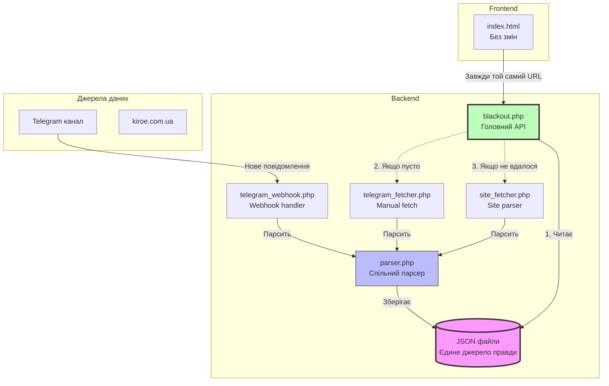

# План інтеграції Telegram бота з каскадним fallback

## Спрощена архітектура



## Структура файлів

### 1. JSON файли для зберігання даних

**Структура файлів:**

#### `api/cache/schedules.json`

Головний файл з графіками відключень (єдине джерело правди):

```json
{
  "timestamp": 1737369600,
  "date": "20.01.2026",
  "emergency_mode": false,
  "source": "telegram",
  "queues": {
    "1.1": "00:00-02:00, 04:00-07:00, 08:00-10:00, 11:00-14:00, 15:00-18:00, 20:00-23:00",
    "1.2": "00:00-02:00, 04:00-06:00, 07:00-10:00, 11:00-14:00, 15:00-18:00, 19:00-22:00",
    "2.1": "00:00-02:00, 04:00-06:00, 08:00-10:00, 11:00-14:00, 15:00-18:00, 19:00-22:00",
    "2.2": "00:00-02:00, 04:00-06:00, 08:00-11:00, 12:00-15:00, 16:00-19:00, 20:00-22:00",
    "3.1": "00:00-02:00, 04:00-06:00, 08:00-11:00, 12:00-15:00, 16:00-19:00, 20:00-22:00",
    "3.2": "00:00-02:00, 04:00-06:00, 08:00-11:00, 12:00-15:00, 16:00-19:00, 20:00-22:00, 23:00-24:00",
    "4.1": "02:00-04:00, 06:00-09:00, 10:00-13:00, 14:00-17:00, 18:00-20:00, 22:00-24:00",
    "4.2": "02:00-04:00, 06:00-09:00, 10:00-13:00, 14:00-17:00, 18:00-21:00, 22:00-24:00",
    "5.1": "02:00-04:00, 06:00-08:00, 10:00-13:00, 14:00-17:00, 18:00-21:00, 22:00-24:00",
    "5.2": "02:00-04:00, 06:00-08:00, 09:00-12:00, 13:00-16:00, 17:00-20:00, 22:00-24:00",
    "6.1": "02:00-04:00, 06:00-08:00, 09:00-12:00, 13:00-16:00, 17:00-20:00, 21:00-24:00",
    "6.2": "02:00-04:00, 06:00-08:00, 10:00-12:00, 13:00-16:00, 17:00-20:00, 21:00-24:00"
  },
  "raw_message": "⚠ 20.01.2026 - Графік погодинних відключень\n\nЗа розпорядженням НЕК..."
}
```

#### `api/cache/telegram_messages.json`

Історія отриманих повідомлень з Telegram:

```json
[
  {
    "message_id": 12345,
    "chat_id": -1001234567890,
    "text": "⚠ 20.01.2026 - Графік погодинних відключень...",
    "date": 1737369600,
    "parsed": true,
    "saved_at": 1737369605
  },
  {
    "message_id": 12346,
    "chat_id": -1001234567890,
    "text": "❗Увага! Важлива інформація!\n\n20.01.2026 з 13 год...",
    "date": 1737382020,
    "parsed": true,
    "saved_at": 1737382025
  }
]
```

#### `api/logs/api_YYYY-MM-DD.log`

Логи запитів (по одному файлу на день, як зараз):

```json
{"timestamp":"2026-01-20 15:30:45.123","queue":"1.1","source":"cache","response_time_ms":2.5,"success":true,"ip":"192.168.1.100","user_agent":"Mozilla/5.0..."}
{"timestamp":"2026-01-20 15:31:12.456","queue":"all","source":"cache","response_time_ms":3.1,"success":true,"ip":"192.168.1.101","user_agent":"Mozilla/5.0..."}
```

### 2. Конфігурація: `api/config.php`

```php
<?php
// Telegram Bot налаштування
define('TELEGRAM_BOT_TOKEN', 'YOUR_BOT_TOKEN_HERE');
define('TELEGRAM_WEBHOOK_SECRET', 'RANDOM_SECRET_KEY_32_CHARS');

// Setup скрипт (для налаштування через браузер)
define('SETUP_PASSWORD', 'CHANGE_THIS_PASSWORD_123');

// Шляхи до файлів
define('CACHE_DIR', __DIR__ . '/cache');
define('SCHEDULES_FILE', CACHE_DIR . '/schedules.json');
define('MESSAGES_FILE', CACHE_DIR . '/telegram_messages.json');

// Безпека
define('API_RATE_LIMIT', 100); // запитів на хвилину з одного IP
define('MAX_MESSAGE_SIZE', 10000); // максимальний розмір повідомлення

// Джерела даних
define('SOURCE_TELEGRAM', 'telegram');
define('SOURCE_SITE', 'kiroe.com.ua');
define('SITE_URL', 'https://kiroe.com.ua/electricity-blackout');

// TTL для даних (в секундах)
define('DATA_TTL', 86400); // 24 години

// Логування
define('LOGS_DIR', __DIR__ . '/logs');
define('ENABLE_LOGGING', true);
?>
```

**ВАЖЛИВО:** Цей файл додається в `.gitignore` і створюється на сервері вручну!

### 3. Робота з JSON файлами: `api/data.php`

**Функціонал:**

- `getSchedules($queue = null)` - читання графіків з schedules.json
- `saveSchedules($queues, $date, $emergencyMode, $source, $rawMessage = '')` - збереження графіків
- `isDataEmpty()` - перевірка чи файл існує та не порожній
- `isDataFresh($ttl = DATA_TTL)` - перевірка актуальності даних
- `logApiRequest($data)` - логування запиту в api_YYYY-MM-DD.log
- `saveTelegramMessage($messageData)` - додавання повідомлення в telegram_messages.json
- `getTelegramMessages($limit = 100)` - читання історії повідомлень
- `cleanOldLogs($daysToKeep = 30)` - видалення старих log файлів

**Приклад функції:**

```php
function getSchedules($queue = null) {
    if (!file_exists(SCHEDULES_FILE)) {
        return null;
    }
    
    $data = json_decode(file_get_contents(SCHEDULES_FILE), true);
    if (!$data) {
        return null;
    }
    
    if ($queue === null) {
        // Повертаємо всі черги
        return $data;
    }
    
    // Повертаємо конкретну чергу
    if (isset($data['queues'][$queue])) {
        return [
            'queue' => $queue,
            'schedule' => $data['queues'][$queue],
            'timestamp' => $data['timestamp'],
            'date' => $data['date'],
            'emergency_mode' => $data['emergency_mode'],
            'source' => $data['source']
        ];
    }
    
    return null;
}
```

**Безпека:**

- File locking при записі (LOCK_EX)
- Atomic write через temp file
- Валідація JSON перед збереженням
- Обробка помилок файлової системи
- Права доступу 0644 для файлів

### 4. Парсер: `api/parser.php`

**Функціонал:**

- `parseScheduleMessage($text)` - парсинг повідомлення про графік
- `detectEmergencyMode($text)` - виявлення ГАВ (введено/скасовано)
- `extractDate($text)` - витягування дати
- `extractQueues($text)` - витягування черг та графіків
- `normalizeSchedule($schedule)` - нормалізація формату "HH-HH" → "HH:00-HH:00"
- `validateSchedule($schedule)` - валідація графіку

**Підтримувані формати:**

- Telegram: "Черга 1.1: 00-02, 04-07, 08-10"
- Сайт: HTML з таблицею або текстом

**Регулярні вирази:**

```php
// Дата: 20.01.2026
$datePattern = '/(\d{2}\.\d{2}\.\d{4})/';

// Черга: "Черга 1.1: 00-02, 04-07"
$queuePattern = '/Черга\s+(\d+\.\d+)\s*:\s*(.+?)(?=\n\s*Черга|\n\n|$)/is';

// ГАВ введено
$gavOnPattern = '/введено\s+в\s+дію\s+графік\s+аварійних/i';

// ГАВ скасовано
$gavOffPattern = '/графіка?\s+аварійних.*скасовано/i';
```

### 5. Telegram Webhook: `api/telegram_webhook.php`

**Призначення:** Приймає webhook від Telegram Bot API при нових повідомленнях в каналі.

**Логіка:**

1. Перевірка безпеки (webhook secret в URL параметрі)
2. Валідація вхідних даних від Telegram
3. Збереження повідомлення в БД
4. Парсинг через `parser.php`
5. Якщо знайдено графік → збереження в БД
6. Логування

**URL:** `https://xain.in.ua/api/telegram_webhook.php?secret=WEBHOOK_SECRET`

**Безпека:**

- Перевірка секретного ключа
- Валідація структури Telegram update
- Rate limiting (макс 60 запитів/хвилину)
- Обмеження розміру повідомлення
- IP whitelist для Telegram серверів (опціонально)

### 6. Telegram Fetcher: `api/telegram_fetcher.php`

**Призначення:** Отримує останні повідомлення через Telegram Bot API методом `getUpdates`.

**Використання:**

- Викликається з `blackout.php` якщо БД пуста
- Може викликатися вручну через CLI

**Функціонал:**

- `getLatestMessages($limit = 10)` - отримання останніх повідомлень
- `parseAndSaveMessage($message)` - парсинг та збереження
- Обробка тільки channel_post (повідомлення з каналу)

**CLI використання:**

```bash
php api/telegram_fetcher.php
```

### 7. Site Fetcher: `api/site_fetcher.php`

**Призначення:** Парсинг даних з kiroe.com.ua (перенесена логіка з поточного `blackout.php`).

**Функціонал:**

- `fetchFromSite()` - завантаження HTML
- `parseHTML($html)` - парсинг HTML через DOMDocument
- Повертає масив черг або false при помилці

**Переіспользування:**

Весь поточний код парсингу з `blackout.php` переноситься сюди без змін.

### 8. Головний API: `api/blackout.php` (ОНОВЛЕНИЙ)

**Нова логіка:**

```php
// 1. Читаємо з JSON кешу
$data = getSchedules($queue);

if ($data && isDataFresh(DATA_TTL)) {
    // Дані є і свіжі → повертаємо
    return $data;
}

// 2. Дані застарілі або відсутні → пробуємо оновити

// 2a. Спочатку через Telegram
try {
    require_once 'telegram_fetcher.php';
    $telegramData = fetchFromTelegram();
    if ($telegramData && !empty($telegramData['queues'])) {
        saveSchedules($telegramData['queues'], $telegramData['date'], 
                     $telegramData['emergency_mode'], SOURCE_TELEGRAM, 
                     $telegramData['raw_message']);
        return getSchedules($queue);
    }
} catch (Exception $e) {
    logError('Telegram fetch failed: ' . $e->getMessage());
}

// 2b. Якщо Telegram не вдався → пробуємо сайт
try {
    require_once 'site_fetcher.php';
    $siteData = fetchFromSite();
    if ($siteData && !empty($siteData['queues'])) {
        saveSchedules($siteData['queues'], $siteData['date'], 
                     $siteData['emergency_mode'], SOURCE_SITE);
        return getSchedules($queue);
    }
} catch (Exception $e) {
    logError('Site fetch failed: ' . $e->getMessage());
}

// 3. Нічого не вдалося → повертаємо помилку або старі дані
if ($data) {
    // Повертаємо застарілі дані з попередженням
    return ['warning' => 'Data is outdated', 'data' => $data];
} else {
    // Зовсім немає даних
    return ['error' => 'No data available'];
}
```

**Параметри (без змін):**

- `?queue=X.X` - конкретна черга
- `?all=1` - всі черги

**Відповідь (без змін):**

```json
{
  "success": true,
  "queue": "1.1",
  "schedule": "00:00-02:00, 04:00-07:00, ...",
  "emergency_mode": false,
  "updated": 1234567890,
  "source": "telegram"
}
```

### 9. Setup скрипт: `api/telegram_setup.php`

**ВАЖЛИВО:** Немає консольного доступу до сервера, тому це буде веб-скрипт з захистом паролем.

**Призначення:** Веб-інтерфейс для налаштування Telegram бота (запускається через браузер).

**URL:** `https://xain.in.ua/api/telegram_setup.php?password=SECRET_PASSWORD`

**Функції (через GET параметри):**

- `?password=XXX&action=set_webhook` - встановити webhook
- `?password=XXX&action=delete_webhook` - видалити webhook  
- `?password=XXX&action=info` - інформація про бота
- `?password=XXX&action=fetch` - завантажити останні повідомлення
- `?password=XXX&action=init` - створити структуру папок
- `?password=XXX&action=test` - тест з'єднання

**Безпека:**

- Перевірка пароля (в config.php)
- Після налаштування видалити файл або змінити пароль

### 10. Безпека: `api/.htaccess`

**Захист конфігураційних файлів та JSON кешу:**

```apache
# Заборона доступу до config.php
<Files "config.php">
    Require all denied
</Files>

# Заборона доступу до службових PHP файлів
<FilesMatch "^(data|parser|telegram_fetcher|site_fetcher|telegram_setup)\.php$">
    Require all denied
</FilesMatch>

# Дозвіл доступу тільки до публічних endpoint'ів
<FilesMatch "\.(php)$">
    # Дозволені файли
    <If "%{REQUEST_URI} =~ /blackout\.php$/">
        Require all granted
    </If>
    <ElseIf "%{REQUEST_URI} =~ /telegram_webhook\.php$/">
        Require all granted
    </ElseIf>
    <ElseIf "%{REQUEST_URI} =~ /test-cors\.php$/">
        Require all granted
    </ElseIf>
    <Else>
        Require all denied
    </Else>
</FilesMatch>
```

**Додатково:** Створити `api/cache/.htaccess`:

```apache
# Заборона прямого доступу до JSON файлів
<FilesMatch "\.(json)$">
    Require all denied
</FilesMatch>
```

## Безпека

### 1. Telegram Webhook

- **Secret URL параметр:** `?secret=RANDOM_32_CHARS`
- **Валідація update structure:** Перевірка обов'язкових полів
- **IP Whitelist (опціонально):** Telegram server IPs
- **Rate limiting:** Максимум 60 запитів/хв

### 2. API Endpoints

- **Rate limiting:** 100 запитів/хв з одного IP
- **CORS:** Тільки з дозволених доменів
- **Input validation:** Всі параметри валідуються
- **SQL Injection:** PDO prepared statements
- **XSS Protection:** htmlspecialchars() для виводу

### 3. Файлова система

- **config.php:** Заборонений через .htaccess
- **JSON кеш:** Заборонений прямий доступ через .htaccess
- **Службові PHP:** Заборонені через .htaccess (data.php, parser.php, тощо)
- **Логи:** Поза web root або захищені .htaccess

### 4. Rate Limiting

```php
function checkRateLimit($ip, $limit = 100) {
    // Використання БД або файлів для підрахунку
    $requests = getRequestCount($ip, 60); // за останню хвилину
    if ($requests > $limit) {
        http_response_code(429);
        exit('Rate limit exceeded');
    }
}
```

## Оновлення .gitignore

```gitignore
# Конфігурація (містить секретні токени)
api/config.php

# JSON кеш з даними
api/cache/schedules.json
api/cache/telegram_messages.json

# Логи
api/logs/*.log

# Тимчасові файли
api/cache/*.tmp
```

## Налаштування на сервері (БЕЗ консольного доступу)

### Крок 1: Створення Telegram бота

1. Відкрити [@BotFather](https://t.me/BotFather) в Telegram
2. Надіслати команду: `/newbot`
3. Вказати ім'я бота: наприклад "Krop Electro Bot"
4. Вказати username: наприклад `krop_electro_bot`
5. **Зберегти Bot Token** (формат: `1234567890:ABCdefGHIjklMNOpqrsTUVwxyz`)

### Крок 2: Підготовка файлів локально

1. Створити файл `api/config.php` на основі `api/config.example.php`
2. Вставити в config.php:

   - `TELEGRAM_BOT_TOKEN` - токен від BotFather
   - `TELEGRAM_WEBHOOK_SECRET` - випадковий рядок (32+ символи)
   - `SETUP_PASSWORD` - пароль для setup скрипта

3. Зберегти config.php (НЕ комітити в git!)

### Крок 3: Завантаження на сервер

1. Завантажити всі файли з `api/` на сервер
2. Переконатися що структура правильна:
   ```
   api/
   ├── blackout.php
   ├── config.php (ваш з токенами)
   ├── config.example.php
   ├── data.php
   ├── parser.php
   ├── telegram_webhook.php
   ├── telegram_fetcher.php
   ├── site_fetcher.php
   ├── telegram_setup.php
   ├── .htaccess
   ├── cache/
   │   └── .htaccess
   └── logs/
   ```


### Крок 4: Ініціалізація через браузер

Відкрити в браузері (замінити PASSWORD на ваш):

```
https://xain.in.ua/api/telegram_setup.php?password=PASSWORD&action=init
```

Має створити папки `cache/` та `logs/` якщо їх немає.

### Крок 5: Встановлення webhook

```
https://xain.in.ua/api/telegram_setup.php?password=PASSWORD&action=set_webhook
```

Має показати: "✅ Webhook встановлено успішно"

### Крок 6: Перевірка статусу

```
https://xain.in.ua/api/telegram_setup.php?password=PASSWORD&action=info
```

Має показати інформацію про бота та webhook.

### Крок 7: Додання бота до каналу

**Якщо є доступ до каналу @SvitloKropyvnytskyiMisto:**

1. Відкрити канал в Telegram
2. Натиснути на назву каналу → "Адміністратори" → "Додати адміністратора"
3. Знайти вашого бота за username (наприклад @krop_electro_bot)
4. Додати з мінімальними правами (можна вимкнути всі галочки)

**Якщо немає доступу до каналу:**

1. Створити свій власний канал в Telegram
2. Додати бота як адміністратора
3. Пересилати повідомлення з @SvitloKropyvnytskyiMisto в свій канал
4. Бот оброблятиме повідомлення з вашого каналу

### Крок 8: Початкове завантаження даних

Після додавання бота до каналу, завантажити останні повідомлення:

```
https://xain.in.ua/api/telegram_setup.php?password=PASSWORD&action=fetch
```

Має завантажити останні повідомлення та створити schedules.json.

### Крок 9: Тест API

Відкрити в браузері:

```
https://xain.in.ua/api/blackout.php?queue=1.1
```

Має повернути JSON з графіком.

### Крок 10: Безпека (ВАЖЛИВО!)

Після налаштування:

1. **Варіант 1:** Видалити `telegram_setup.php` з сервера
2. **Варіант 2:** Змінити `SETUP_PASSWORD` в config.php на новий

## Переваги архітектури

1. **Прозорість для фронтенду:** index.html не змінюється взагалі
2. **Надійність:** Три рівні fallback (JSON кеш → Telegram → Сайт)
3. **Швидкість:** JSON файли читаються миттєво
4. **Автоматичність:** Webhook оновлює дані в реальному часі
5. **Незалежність:** Не залежить від одного джерела
6. **Історія:** Всі повідомлення зберігаються в telegram_messages.json
7. **Логування:** Повна аудит історія
8. **Безпека:** Багаторівневий захист
9. **Модульність:** Легко тестувати та підтримувати
10. **Простота:** Не потрібна БД на сервері, тільки PHP
11. **Портативність:** JSON файли легко редагувати, бекапити, переносити
12. **Читабельність:** Можна відкрити та перевірити дані вручну

## Тестування

### 1. Тест API (основний)

Відкрити в браузері:

```
https://xain.in.ua/api/blackout.php?queue=1.1
```

Має повернути JSON:

```json
{
  "success": true,
  "queue": "1.1",
  "schedule": "00:00-02:00, 04:00-07:00, ...",
  "emergency_mode": false,
  "updated": 1737369600,
  "source": "telegram"
}
```

### 2. Тест всіх черг

```
https://xain.in.ua/api/blackout.php?all=1
```

### 3. Тест інформації про бота

```
https://xain.in.ua/api/telegram_setup.php?password=PASSWORD&action=info
```

### 4. Тест webhook (симуляція)

Надіслати повідомлення в канал де бот є адміністратором і перевірити:

1. Логи: `api/logs/telegram_YYYY-MM-DD.log`
2. Історія: `api/cache/telegram_messages.json`
3. Графік: `api/cache/schedules.json`

### 5. Тест fallback механізму

1. Перейменувати `api/cache/schedules.json` → `schedules.json.bak`
2. Відкрити `api/blackout.php?queue=1.1`
3. Має спробувати Telegram → Сайт і створити новий schedules.json
4. Перевірити в логах послідовність спроб

## Міграція з поточного рішення

1. **Резервне копіювання:** Зберегти поточний `blackout.php` як `blackout_old.php`
2. **Паралельний запуск:** Обидва API працюють одночасно
3. **Тестування:** Перевірити новий API на тестовому домені
4. **Перемикання:** Змінити URL в index.html
5. **Моніторинг:** Стежити за логами 24-48 годин
6. **Видалення:** Прибрати старий код після успішної міграції

## Обслуговування (опціонально)

### Очищення логів

**Через панель хостингу (якщо є cron):**

```bash
# Щодня о 3:00 ночі
0 3 * * * wget -O - "https://xain.in.ua/api/telegram_setup.php?password=PASSWORD&action=cleanup"
```

**Вручну:** Періодично видаляти старі файли з `api/logs/`

### Бекап JSON файлів

**Автоматично (якщо є cron в панелі хостингу):**

Створити скрипт `api/backup.php` і викликати через cron.

**Вручну:** Періодично завантажувати файли:

- `api/cache/schedules.json`
- `api/cache/telegram_messages.json`

### Моніторинг

- Розмір JSON файлів (schedules.json, telegram_messages.json)
- Кількість запитів (з логів)
- Час останнього оновлення (timestamp в schedules.json)
- Помилки в логах
- Кількість повідомлень в історії

---

## ІНСТРУКЦІЯ: Налаштування Telegram бота руками

### Покрокова інструкція для користувача

#### 1. Створення бота через BotFather

1. Відкрийте Telegram
2. Знайдіть бота [@BotFather](https://t.me/BotFather)
3. Натисніть "Start" або надішліть `/start`
4. Надішліть команду: `/newbot`
5. BotFather запитає ім'я бота. Надішліть: `Krop Electro Bot` (або будь-яке інше)
6. BotFather запитає username (має закінчуватися на `bot`). Надішліть: `krop_electro_bot`
7. **ВАЖЛИВО:** BotFather надішле вам токен. Виглядає так:
   ```
   1234567890:ABCdefGHIjklMNOpqrsTUVwxyz-1234567890
   ```

8. **Скопіюйте цей токен** - він знадобиться в наступних кроках

#### 2. Створення config.php локально

1. На вашому комп'ютері відкрийте папку проєкту
2. Скопіюйте файл `api/config.example.php` → `api/config.php`
3. Відкрийте `api/config.php` в текстовому редакторі
4. Знайдіть рядок:
   ```php
   define('TELEGRAM_BOT_TOKEN', 'YOUR_BOT_TOKEN_HERE');
   ```

5. Замініть `YOUR_BOT_TOKEN_HERE` на токен від BotFather (з крок 1.7)
6. Знайдіть рядок:
   ```php
   define('TELEGRAM_WEBHOOK_SECRET', 'RANDOM_SECRET_KEY_32_CHARS');
   ```

7. Замініть на будь-який випадковий рядок (32+ символів), наприклад:
   ```php
   define('TELEGRAM_WEBHOOK_SECRET', 'mY_sEcReT_wEbHoOk_kEy_12345678');
   ```

8. Знайдіть рядок:
   ```php
   define('SETUP_PASSWORD', 'CHANGE_THIS_PASSWORD_123');
   ```

9. Замініть на ваш пароль для setup скрипта, наприклад:
   ```php
   define('SETUP_PASSWORD', 'MySecurePassword999');
   ```

10. **Збережіть файл**
11. **НЕ комітьте config.php в git!** (він вже в .gitignore)

#### 3. Завантаження файлів на сервер

1. Підключіться до сервера через FTP/SFTP (FileZilla, WinSCP, тощо)
2. Перейдіть в папку `api/`
3. Завантажте ВСІ файли з локальної папки `api/`:

   - `blackout.php`
   - `config.php` (ваш з токенами!)
   - `config.example.php`
   - `data.php`
   - `parser.php`
   - `telegram_webhook.php`
   - `telegram_fetcher.php`
   - `site_fetcher.php`
   - `telegram_setup.php`
   - `.htaccess`

4. Створіть папки (якщо їх немає):

   - `api/cache/`
   - `api/logs/`

5. Завантажте `.htaccess` в папку `api/cache/`

#### 4. Ініціалізація через браузер

1. Відкрийте браузер
2. Вставте URL (замініть PASSWORD на ваш з config.php):
   ```
   https://xain.in.ua/api/telegram_setup.php?password=MySecurePassword999&action=init
   ```

3. Натисніть Enter
4. Має з'явитися повідомлення: `✅ Структура папок створена`

#### 5. Встановлення Webhook

1. В браузері вставте URL:
   ```
   https://xain.in.ua/api/telegram_setup.php?password=MySecurePassword999&action=set_webhook
   ```

2. Має з'явитися: `✅ Webhook встановлено успішно`
3. URL webhook буде: `https://xain.in.ua/api/telegram_webhook.php?secret=ВАШ_SECRET`

#### 6. Перевірка налаштувань

1. Вставте URL:
   ```
   https://xain.in.ua/api/telegram_setup.php?password=MySecurePassword999&action=info
   ```

2. Має показати інформацію про бота:

   - Username
   - Webhook URL
   - Статус webhook

#### 7. Додання бота до каналу

**ВАРІАНТ А: Якщо ви адміністратор каналу @SvitloKropyvnytskyiMisto**

1. Відкрийте канал в Telegram
2. Натисніть на назву каналу вгорі
3. Оберіть "Адміністратори"
4. Натисніть "Додати адміністратора"
5. Знайдіть вашого бота (наприклад @krop_electro_bot)
6. Додайте його
7. Права можна залишити мінімальні (можна вимкнути всі галочки)
8. Збережіть

**ВАРІАНТ Б: Якщо ви НЕ адміністратор каналу**

1. Створіть власний канал в Telegram:

   - Натисніть на меню → "Новий канал"
   - Назва: "Світло Кропивницький Копія" (або будь-яка інша)
   - Тип: Публічний або Приватний

2. Додайте бота як адміністратора (як у Варіанті А)
3. Тепер ви можете пересилати повідомлення:

   - Відкрийте @SvitloKropyvnytskyiMisto
   - Знайдіть повідомлення з графіком
   - Натисніть "Forward" → оберіть ваш канал
   - Переслане повідомлення буде оброблене ботом

#### 8. Завантаження початкових даних

1. В браузері вставте URL:
   ```
   https://xain.in.ua/api/telegram_setup.php?password=MySecurePassword999&action=fetch
   ```

2. Бот спробує завантажити останні повідомлення з каналу
3. Має створити файл `api/cache/schedules.json`

#### 9. Тест API

1. Відкрийте в браузері:
   ```
   https://xain.in.ua/api/blackout.php?queue=1.1
   ```

2. Має показати JSON з графіком:
   ```json
   {
     "success": true,
     "queue": "1.1",
     "schedule": "00:00-02:00, 04:00-07:00, ...",
     "emergency_mode": false,
     "updated": 1737369600,
     "source": "telegram"
   }
   ```


#### 10. Відкрийте веб-додаток

1. Відкрийте: `https://xain.in.ua/krop-electro-schedule/`
2. Має показати графік з даними
3. Оберіть різні черги - має працювати

#### 11. Безпека (ОБОВ'ЯЗКОВО!)

**Після успішного налаштування:**

1. **Видаліть** файл `api/telegram_setup.php` з сервера

АБО

2. **Змініть пароль** в `api/config.php`:
   ```php
   define('SETUP_PASSWORD', 'NEW_DIFFERENT_PASSWORD_HERE');
   ```


І завантажте оновлений config.php на сервер

**Чому це важливо?**

- Setup скрипт дає доступ до налаштувань бота
- Якщо хтось дізнається пароль - зможе змінити webhook
- Після налаштування цей скрипт не потрібен

### Що робити якщо щось не працює?

#### Проблема: "Invalid bot token"

- Перевірте чи правильно скопіювали токен з BotFather
- Токен має бути БЕЗ пробілів на початку/кінці
- Перевірте чи config.php завантажений на сервер

#### Проблема: "Webhook failed"

- Перевірте чи сервер доступний по HTTPS
- Перевірте чи файл telegram_webhook.php існує
- Перевірте чи правильний TELEGRAM_WEBHOOK_SECRET в config.php

#### Проблема: "No data available"

- Перевірте чи бот доданий до каналу як адміністратор
- Надішліть тестове повідомлення в канал
- Перевірте логи: `api/logs/telegram_YYYY-MM-DD.log`
- Спробуйте `action=fetch` ще раз

#### Проблема: API не повертає дані

- Перевірте чи файл `api/cache/schedules.json` існує
- Перевірте права доступу до папки cache (повинно бути 755)
- Перевірте логи помилок PHP на сервері

### Контакти для допомоги

Якщо щось не виходить - збережіть:

- Скріншот помилки
- Вміст логів (`api/logs/telegram_*.log`)
- Опис що саме робили

---

**Готово!** Після цих кроків система буде автоматично отримувати графіки з Telegram каналу в реальному часі.
